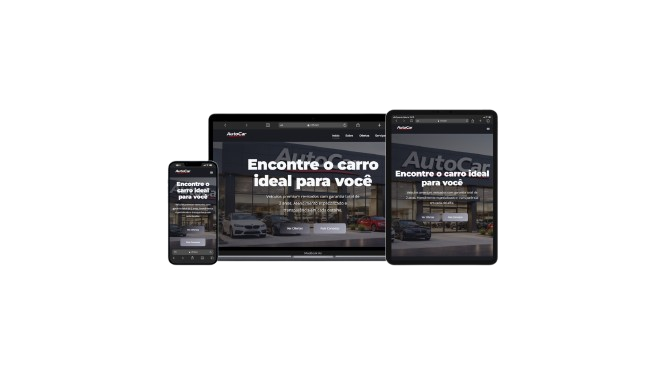

# 🚗 AutoCar — Website Institucional

---

## 📌 Sobre o Projeto

O **AutoCar** é um site institucional moderno desenvolvido para uma concessionária automotiva, com foco em **experiência do usuário**, **design premium** e **alta conversão**.

O projeto foi construído com uma abordagem responsiva, garantindo uma navegação fluida em dispositivos móveis, tablets e desktops.

---

## 🎯 Objetivos

* Criar uma presença digital profissional
* Melhorar a experiência do usuário (UX)
* Apresentar veículos de forma clara e atrativa
* Facilitar o contato com clientes
* Aumentar conversão de leads

---

## 🚀 Funcionalidades

* ✅ Página inicial com destaque visual (Hero Section)
* ✅ Navegação entre páginas (SPA-like)
* ✅ Página de ofertas com listagem de veículos
* ✅ Página de serviços oferecidos
* ✅ Página de contato com formulário
* ✅ Layout responsivo (Mobile First)
* ✅ Design moderno com foco em conversão
* ✅ Botões de ação (CTA)
* ✅ Estrutura otimizada para SEO

---

## 🧩 Tecnologias Utilizadas

* **HTML5** → Estrutura semântica
* **CSS3** → Estilização moderna
* **JavaScript** → Interatividade
* **Google Fonts** → Tipografia profissional
* **Design Responsivo** → Mobile, Tablet e Desktop

---

## 🎨 Paleta de Cores

| Cor              | Código  |
| ---------------- | ------- |
| Background Dark  | #1B1C22 |
| Secundária       | #7E7B8A |
| Texto Suave      | #A6A8B4 |
| Branco Principal | #F7F8FA |

---

## 📱💻 Preview Responsivo



---

## 🧠 Estrutura do Projeto

```bash
📦 AutoCar
 ┣ 📂 assets
 ┃ ┣ 📂 images
 ┃ ┗ 📂 icons
 ┣ 📂 css
 ┃ ┗ style.css
 ┣ 📂 js
 ┃ ┗ script.js
 ┣ 📄 index.html
 ┣ 📄 sobre.html
 ┣ 📄 ofertas.html
 ┣ 📄 servicos.html
 ┣ 📄 contato.html
```

---

## ⚙️ Boas Práticas Aplicadas

* ✔ HTML semântico
* ✔ Código organizado e escalável
* ✔ Separação de responsabilidades (HTML, CSS, JS)
* ✔ Responsividade completa
* ✔ Performance otimizada
* ✔ UX/UI moderna

---

## 🔥 Diferenciais

* Design inspirado em grandes marcas automotivas
* Interface limpa e profissional
* Experiência fluida em qualquer dispositivo
* Estrutura pronta para evolução (API, backend, etc.)

---

## 📈 Melhorias Futuras

* 🔹 Integração com API de veículos
* 🔹 Sistema de login/admin
* 🔹 Filtros avançados de busca
* 🔹 Simulador de financiamento
* 🔹 Integração com WhatsApp

---

## 📞 Contato

Caso queira desenvolver um projeto semelhante ou melhorar sua presença digital:

* 📱 WhatsApp: ttps://wa.me/5585997013067
* 🌐 Portfólio: https://devforgeweb.netlify.app/

---

## 📄 Licença

Este projeto está sob a licença **MIT** — sinta-se livre para usar e modificar.
